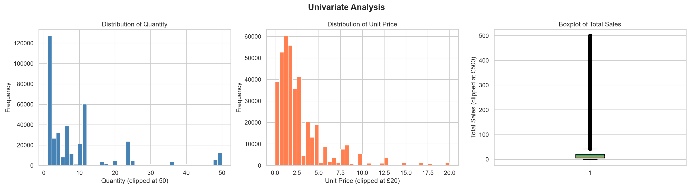
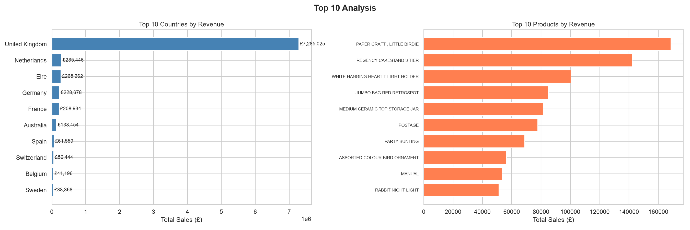
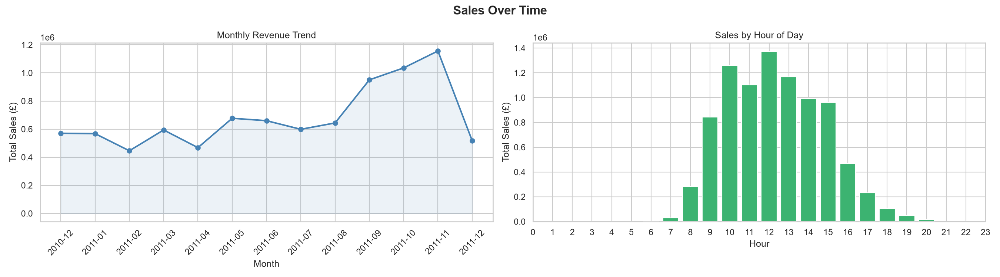
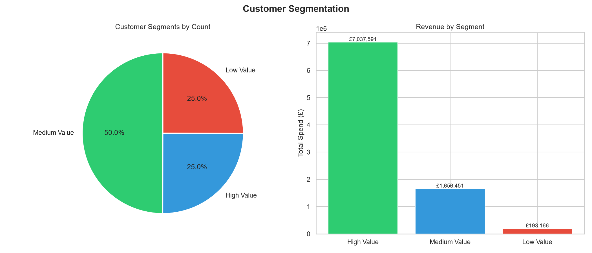
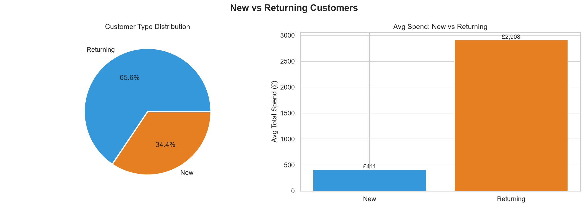
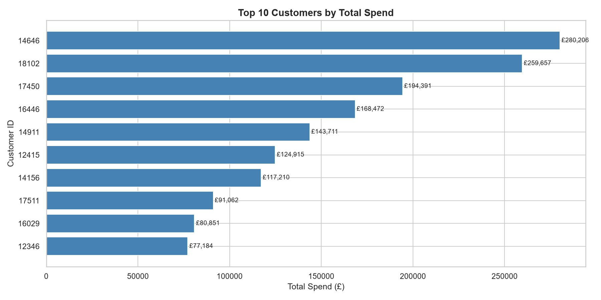
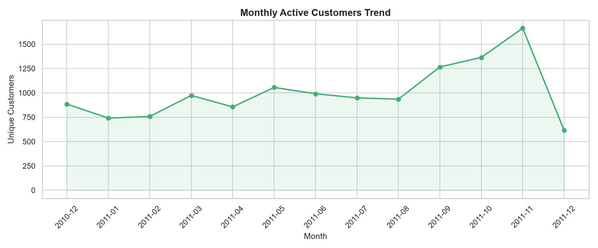

<div align="center">

# 🛒 ReadyNest Internship — Data Analytics


**Intern:** Harshit Saxena &nbsp;|&nbsp; **Organization:** ReadyNest Corp. &nbsp;|&nbsp; **June 2026**

</div>

---

## 🔗 Live Dashboards

<div align="center">

| Week | Project | Dashboard |
|------|---------|-----------|
| 📦 **Week 1** | Dataset Analysis & Reporting | [](https://public.tableau.com/app/profile/harshit.saxena4505/viz/readynesttasktrial1/Sheet1) |
| 👥 **Week 2** | Customer Insights & Segmentation | [](https://public.tableau.com/app/profile/harshit.saxena4505/viz/Task2_17824998555060/Dashboard1) |

</div>

---

## 📁 Repository Structure

```
readynest-internship/
│
├── 📂 charts/
│   ├── chart1_univariate.png
│   ├── chart2_top10.png
│   ├── chart3_timeseries.png
│   ├── chart4_bivariate.png
│   ├── chart5_dayofweek.png
│   ├── chart6_segmentation.png
│   ├── chart7_new_vs_returning.png
│   ├── chart8_top_customers.png
│   └── chart9_customer_growth.png
│
├── step1_data_loading.py
├── step2_data_cleaning.py
├── step3_eda.py
├── week2_customer_segmentation.py
├── cleaned_data.csv
├── customer_segments.csv
├── ReadyNest_Week2_Business_Report.pptx
└── README.md
```

---

## 📦 Week 1 — Dataset Analysis & Reporting

<details>
<summary><b>📋 Click to expand Week 1</b></summary>

<br>

### 🎯 Objective
Analyze a comprehensive E-Commerce dataset, perform data cleaning and EDA, and create an interactive Tableau dashboard.

### 📊 Dataset Overview

| Property | Value |
|----------|-------|
| 📄 Source | E-Commerce Online Retail (UCI / Kaggle) |
| 📏 Raw Rows | 541,909 |
| ✅ Cleaned Rows | 392,692 |
| 📌 Columns | 8 → 13 (after feature engineering) |
| 🌍 Countries | 37 |
| 📅 Date Range | Dec 2010 – Dec 2011 |

### 🧹 Data Cleaning Steps

| Step | Action | Records Affected |
|------|--------|-----------------|
| 1 | Removed duplicate rows | ~5,268 |
| 2 | Dropped missing CustomerID | ~133,361 |
| 3 | Removed cancelled orders (InvoiceNo starts with 'C') | ~9,288 |
| 4 | Removed negative/zero Quantity & UnitPrice | ~2,300 |
| 5 | Converted InvoiceDate to datetime | All rows |
| 6 | Added TotalSales, Year, Month, Day, Hour columns | All rows |
| 7 | Standardized Description & Country text | All rows |

### 📈 Key Metrics

```
💰 Total Revenue      : £8,887,209
📦 Total Orders       : 25,900
👥 Unique Customers   : 4,338
🌍 Countries Served   : 37
📅 Peak Month         : November 2011
⏰ Peak Hour          : 12:00 PM
📆 Peak Day           : Thursday
🛍️  Top Product        : Paper Craft Little Birdie
🌍 Top Country        : United Kingdom (82%)
```

### 📊 EDA Charts

#### 1️⃣ Univariate Analysis — Distribution of Key Variables



> Histogram of Quantity and Unit Price showing right-skewed distributions, plus a boxplot of Total Sales revealing outlier high-value transactions.

---

#### 2️⃣ Top 10 Analysis — Countries & Products by Revenue



> United Kingdom dominates with £7.28M. Top product — Paper Craft Little Birdie — contributes £168K alone.

---

#### 3️⃣ Monthly Revenue Trend



> Clear upward trend from mid-2011, peaking in November. Strong Q4 seasonality driven by holiday shopping.

---

#### 4️⃣ Bivariate Analysis — Correlation & Scatter


> Strong positive correlation between Quantity and TotalSales (r=0.89). UnitPrice shows minimal correlation with volume.

---

#### 5️⃣ Sales by Day of Week


> Thursday is the strongest sales day. Saturday has zero sales — the store doesn't operate on weekends.

---

### 🖥️ Tableau Dashboard — Week 1

[](https://public.tableau.com/app/profile/harshit.saxena4505/viz/readynesttasktrial1/Sheet1)

**Dashboard includes:**
- 📈 Monthly Revenue Trend (Line Chart)
- 🌍 Top 10 Countries by Revenue (Bar Chart)
- 📦 Top 10 Products by Revenue (Bar Chart)
- ⏰ Sales by Hour of Day (Bar Chart)
- 📆 Sales by Day of Week (Bar Chart)
- 🗺️ Geographic Revenue Map
- 🔢 KPI Cards — Revenue · Orders · Customers

</details>

---

## 👥 Week 2 — Customer Insights & Recommendation Project

<details>
<summary><b>📋 Click to expand Week 2</b></summary>

<br>

### 🎯 Objective
Segment customers into High, Medium, and Low Value groups, analyze behaviour patterns, and provide actionable business recommendations.

### 👤 Customer Segmentation (RFM-Style)

| Segment | Customers | Spend Threshold | Priority |
|---------|-----------|-----------------|----------|
| 🏆 High Value | ~1,085 (25%) | > £1,500 | Retain |
| ⭐ Medium Value | ~2,169 (50%) | £300 – £1,500 | Upsell |
| 🌱 Low Value | ~1,084 (25%) | < £300 | Re-engage |

### 📊 Customer Metrics

```
👥 Total Customers        : 4,338
🔄 Returning Customers    : 74.5%
🆕 New Customers          : 25.5%
💰 Avg Customer Spend     : £2,048
📦 Avg Orders / Customer  : 5.97
🏆 Top Customer Spend     : £280,206
🌍 Top Customer Country   : United Kingdom
```

### 📊 Customer Analysis Charts

#### 6️⃣ Customer Segmentation — Distribution & Revenue



> High Value customers (25%) generate the majority of revenue. Low Value segment represents a significant win-back opportunity.

---

#### 7️⃣ New vs Returning Customers



> 74.5% of customers are returning buyers — strong loyalty signal. Returning customers spend 4x more on average than new ones.

---

#### 8️⃣ Top 10 Customers by Spend



> Top customer alone contributes £280K. Top 10 customers collectively represent a significant share of total revenue.

---

#### 9️⃣ Monthly Customer Growth Trend



> Active customer count grows steadily through 2011, peaking in November — aligning with the revenue trend.

---

### 🖥️ Tableau Dashboard — Week 2

[](https://public.tableau.com/app/profile/harshit.saxena4505/viz/Task2_17824998555060/Dashboard1)

**Dashboard includes:**
- 👥 New vs Returning Customers
- 🥧 Customer Segment Distribution (Pie)
- 📈 Customer Growth Trend (Line)
- 🏆 Top 10 Customers by Spend (Bar)
- 🗺️ Customer Geographic Analysis (Map)
- 💰 Revenue by Customer Segment (Bar)
- 📊 Avg Order Value by Segment

</details>

---

## 💡 Key Business Insights

<table>
<tr>
<td width="50%" valign="top">

**01 🇬🇧 UK Market Dominance**
> UK accounts for **82% of revenue (£7.28M)**. Over-reliance on one market is a strategic risk requiring diversification.

**02 🔄 Strong Customer Loyalty**
> **74.5% are returning customers** — strong brand loyalty. Retention programs will have high ROI.

**03 📅 Q4 Seasonal Spike**
> Revenue peaks Oct–Dec. **November = 12.7% of annual revenue.** Holiday campaigns must be planned 3 months early.

</td>
<td width="50%" valign="top">

**04 🏆 High Value Customers Critical**
> Top 25% of customers drive disproportionate revenue. **Losing even 10% of them significantly impacts the bottom line.**

**05 ⏰ Thursday 12PM is Peak**
> Orders peak at **12 PM on Thursdays**. Flash sales and email blasts timed here will maximize conversion.

**06 🌍 International Untapped**
> Netherlands, EIRE, Germany show organic traction. **Targeted expansion could drive 20%+ revenue growth.**

</td>
</tr>
</table>

---

## 🎯 Business Recommendations

| # | Recommendation | Priority | Expected Impact |
|---|---------------|----------|-----------------|
| 1 | 🏆 **VIP Loyalty Program** — Exclusive perks for High Value customers | 🔴 HIGH | ↑ Retention & LTV |
| 2 | 🌍 **International Expansion** — Target Netherlands, Germany, France | 🔴 HIGH | ↑ 20% Revenue |
| 3 | 📅 **Seasonal Campaign Strategy** — Q4 pre-planning 3 months early | 🔴 HIGH | ↑ Peak Revenue |
| 4 | 🔄 **Win-Back Campaigns** — Personalized offers for Low Value segment | 🟡 MEDIUM | ↑ Customer Count |
| 5 | ⏰ **Time-Targeted Marketing** — Launch campaigns Thu 11 AM | 🟡 MEDIUM | ↑ Conversion Rate |
| 6 | 📦 **Product Bundling** — Gift sets from top sellers for Q4 | 🟡 MEDIUM | ↑ Avg Order Value |

---

## 🛠️ Tech Stack

<div align="center">

| Category | Tools |
|----------|-------|
| 🐍 Language | Python 3.x |
| 📊 Data Analysis | Pandas, NumPy |
| 📈 Visualization | Matplotlib, Seaborn |
| 🖥️ Dashboard | Tableau Public |
| 📄 Reporting | PowerPoint (PPTX) |
| 🔧 Version Control | Git & GitHub |

</div>

---

## ▶️ How to Run

```bash
# Install dependencies
pip install pandas numpy matplotlib seaborn

# Week 1 — Data Loading
python step1_data_loading.py

# Week 1 — Data Cleaning (generates cleaned_data.csv)
python step2_data_cleaning.py

# Week 1 — EDA & Charts (generates chart1–chart5)
python step3_eda.py

# Week 2 — Customer Segmentation (generates customer_segments.csv + chart6–chart9)
python week2_customer_segmentation.py
```

---

## 📬 Contact

<div align="center">

**Harshit Saxena** — ReadyNest Data Analytics Intern | June 2026

[](https://public.tableau.com/app/profile/harshit.saxena4505)
[](https://github.com/HarBit-sys)

---

*Built with ❤️ for ReadyNest Corp. Internship Program*

*"Learn. Analyze. Communicate. Get recognized!"*

</div>
